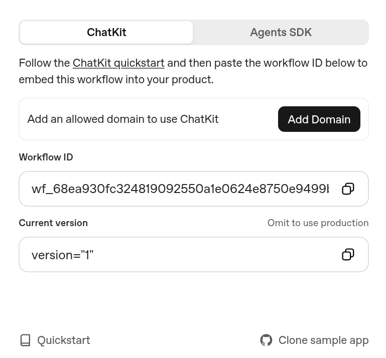
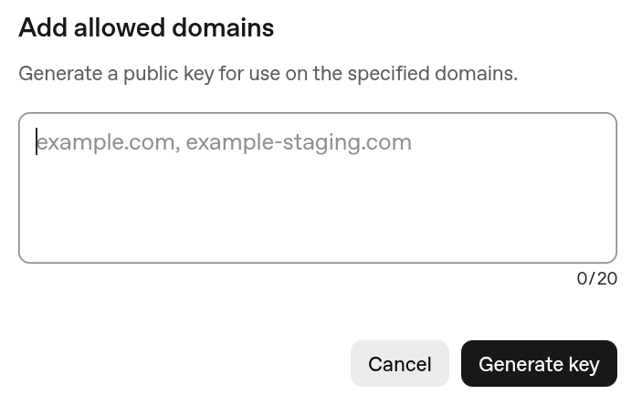

# ChatKit Starter Template

[](LICENSE)


This repository is the simplest way to bootstrap a [ChatKit](http://openai.github.io/chatkit-js/) application. It ships with a minimal Next.js UI, the ChatKit web component, and a ready-to-use session endpoint so you can experiment with OpenAI-hosted workflows built using [Agent Builder](https://platform.openai.com/agent-builder).

## What You Get

- Next.js app with `<openai-chatkit>` web component and theming controls
- API endpoint for creating a session at [`app/api/create-session/route.ts`](app/api/create-session/route.ts)
- Config file for starter prompts, theme, placeholder text, and greeting message

## Getting Started

### 1. Install dependencies

```bash
npm install
```

### 2. Create your environment file

Copy the example file and fill in the required values:

```bash
cp .env.example .env.local
```

You can get your workflow id from the [Agent Builder](https://platform.openai.com/agent-builder) interface, after clicking "Publish":



Make sure you add your development domain:



You can get your OpenAI API key from the [OpenAI API Keys](https://platform.openai.com/api-keys) page.

### 3. Add your domain to the allowlist

**⚠️ IMPORTANT:** Before your ChatKit widget will render, you must add your domain to the [Domain allowlist](https://platform.openai.com/settings/organization/security/domain-allowlist) in your OpenAI organization settings.

- For local development: Add `localhost:3000`
- For Codespaces: Add your Codespace preview URL (e.g., `*.app.github.dev`)
- For production: Add your deployment domain

Without this step, the ChatKit iframe will not load and you'll see a blank screen.

### 4. Configure ChatKit credentials

Update `.env.local` with the variables that match your setup.

- `OPENAI_API_KEY` — API key created **within the same org & project as your Agent Builder**
- `NEXT_PUBLIC_CHATKIT_WORKFLOW_ID` — the workflow you created in [Agent Builder](https://platform.openai.com/agent-builder)
- (optional) `CHATKIT_API_BASE` - customizable base URL for the ChatKit API endpoint

### 5. Run the app

```bash
npm run dev
```

Visit `http://localhost:3000` and start chatting. Use the prompts on the start screen to verify your workflow connection, then customize the UI or prompt list in [`lib/config.ts`](lib/config.ts) and [`components/ChatKitPanel.tsx`](components/ChatKitPanel.tsx).

### 6. Deploy your app

```bash
npm run build
```

Before deploying your app, remember to add your production domain to the [Domain allowlist](https://platform.openai.com/settings/organization/security/domain-allowlist).

## Customization Tips

- Adjust starter prompts, greeting text, [chatkit theme](https://chatkit.studio/playground), and placeholder copy in [`lib/config.ts`](lib/config.ts).
- Update the event handlers inside [`components/.tsx`](components/ChatKitPanel.tsx) to integrate with your product analytics or storage.

## Troubleshooting

### Blank screen or ChatKit widget not loading

**Most common cause:** Your domain is not in the allowlist.

1. Go to [Domain allowlist settings](https://platform.openai.com/settings/organization/security/domain-allowlist)
2. Add your domain (e.g., `localhost:3000` for local development)
3. Refresh your browser

### Session creation fails

- Verify your `OPENAI_API_KEY` is from the same organization and project as your Agent Builder workflow
- Check that your workflow is published in Agent Builder
- Ensure `NEXT_PUBLIC_CHATKIT_WORKFLOW_ID` matches your workflow ID exactly

## References

- [ChatKit JavaScript Library](http://openai.github.io/chatkit-js/)
- [Advanced Self-Hosting Examples](https://github.com/openai/openai-chatkit-advanced-samples)
